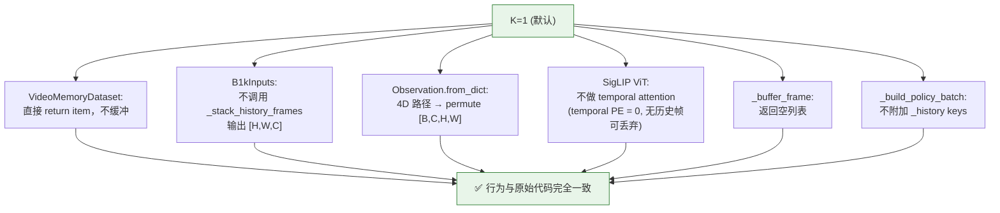

# MEM Short-Term Video Memory — 完整逻辑图

> 本文档以 Mermaid 流程图的形式，展示 MEM 短期视频记忆在 pi0.5-comet 中的完整数据流。
>
> 包含三部分：① 模型架构内部流程 ② 训练数据管道 ③ 推理数据管道

---

## 1. 模型架构内部流程（SigLIP ViT 改造）

```mermaid
graph TD
    subgraph "SigLIP Vision Transformer (改造后)"
        A["输入: images [B*K, C, H, W]"] --> B["Conv2d patch embedding<br/>[B*K, n, d]"]
        B --> C["+ spatial position embedding"]

        C --> D{"Layer i"}

        D --> E["Spatial Self-Attention<br/>(标准 ViT attention, 每帧独立)<br/>对 [B*K, n, d] 做 attention"]
        E --> F["FFN"]

        F --> G{"i % 4 == 3 ?<br/>且 K > 1 ?"}

        G -- "是 (每隔4层)" --> H["temporal_posemb_sincos(K, d)<br/>生成固定 sinusoidal PE<br/>当前帧 t=0 的 PE = 全零向量"]
        H --> I["reshape [B*K, n, d]<br/>→ [B, K, n, d]<br/>→ 转置为 [B, n, K, d]"]
        I --> J["+ temporal PE"]
        J --> K["temporal_causal_attention<br/>在每个 patch 位置上<br/>跨 K 帧做因果自注意力<br/>复用同层 Q/K/V 权重<br/>causal mask: 只看过去帧"]
        K --> L["转置回 [B, K, n, d]<br/>→ reshape [B*K, n, d]"]
        L --> M["继续下一层"]

        G -- "否 (普通层)" --> M

        M --> D

        D -- "所有层结束" --> N{"K > 1 ?"}
        N -- "是" --> O["丢弃历史帧 tokens<br/>[B*K, n, d] → [B, K, n, d]<br/>取 [:, -1, :, :] (当前帧)<br/>→ [B, n, d]"]
        N -- "否 (K=1)" --> P["直接输出 [B, n, d]"]
        O --> Q["输出: image_features [B, n, d]"]
        P --> Q
    end

    style A fill:#e3f2fd,stroke:#1565c0
    style Q fill:#e8f5e9,stroke:#2e7d32
    style H fill:#fff3e0,stroke:#e65100
    style I fill:#fff3e0,stroke:#e65100
    style J fill:#fff3e0,stroke:#e65100
    style K fill:#fff3e0,stroke:#e65100
    style L fill:#fff3e0,stroke:#e65100
    style O fill:#fff3e0,stroke:#e65100
```



**关键设计点：**

- **不引入新参数**：temporal attention 复用同层 spatial attention 的 Q/K/V 权重
- **K=1 完全退化**：temporal PE 在 t=0 时为全零 → 加了等于没加；temporal attention 只有 1 帧 → 等于 identity；不丢弃 → 输出不变
- **每隔 4 层**才做 temporal attention，降低计算开销
- **因果 mask**：当前帧只能看到过去帧，不能看到未来帧

---

## 2. 训练数据管道

```mermaid
graph TD
    subgraph "训练数据流"
        T1["BehaviorLeRobotDataset.__getitem__()"] -->|"单帧 dict:<br/>{observation.images.rgb.head: [C,H,W], ...}"| T2

        T2["PromptFromLeRobotItem()"] -->|"加 prompt 字段"| T3

        T3["🆕 VideoMemoryDataset.__getitem__()"]
        T3 -->|"维护 per-episode deque 缓冲区<br/>按 stride 采样 K-1 帧历史<br/>加入 observation.images.rgb.head_history<br/>= [frame_t-5, ..., frame_t-1]"| T4

        T4["RepackTransform()"]
        T4 -->|"key 重命名:<br/>observation.images.rgb.head<br/>→ observation/egocentric_camera<br/><br/>⚠️ _history key 不在映射表中<br/>原样保留在 dict 里"| T5

        T5["🔧 B1kInputs.__call__()"]
        T5 -->|"K=1: _parse_image → [H,W,C] uint8<br/>K>1: _stack_history_frames()<br/>→ [K,H,W,C] uint8"| T6

        T6["Normalize / ModelTransforms"] -->|"不改变图像维度"| T7

        T7["_collate_fn + torch.as_tensor"] -->|"K=1: [B,H,W,C] torch.uint8<br/>K>1: [B,K,H,W,C] torch.uint8"| T8

        T8["🔧 Observation.from_dict()"]
        T8 -->|"4D: permute → [B,C,H,W] float32<br/>5D: reshape+permute → [B*K,C,H,W] float32<br/>归一化到 [-1, 1]"| T9

        T9["preprocess_observation_pytorch()"] -->|"augmentation, 保持 CHW"| T10

        T10["embed_prefix()"] -->|"num_frames=K 传给 embed_image"| T11

        T11["SigLIP ViT (见上图)"] -->|"[B*K,C,H,W] → [B,n,d]"| T12

        T12["PaliGemma backbone + Action Expert"] -->|"计算 loss / 生成 actions"| T13["输出"]
    end

    style T3 fill:#fff3e0,stroke:#e65100,stroke-width:2px
    style T5 fill:#fff3e0,stroke:#e65100,stroke-width:2px
    style T8 fill:#fff3e0,stroke:#e65100,stroke-width:2px
```



**`_stack_history_frames` 查找逻辑：**

```
查找顺序:
  1. data["observation/egocentric_camera_history"]    ← repacked key + _history (推理时用)
  2. data["observation.images.rgb.head_history"]      ← raw key + _history (训练时用)
  3. 都找不到 → 重复当前帧 K 次 (fallback)
```

---

## 3. 推理数据管道

```mermaid
graph TD
    subgraph "推理数据流"
        I1["OmniGibson env → obs dict"] -->|"raw sensor observations"| I2

        I2["🔧 process_obs()"]
        I2 -->|"resize_with_pad 三个相机<br/>K>1: _buffer_frame() 缓冲每帧<br/>存入 processed_obs['_frame_history']"| I3

        I3{"action_queue<br/>有缓存动作?"}
        I3 -- "有 → 直接返回缓存动作" --> I_END["输出 action"]
        I3 -- "没有 → 需要推理" --> I4

        I4["🆕 _build_policy_batch()"]
        I4 -->|"提取 images/state/prompt<br/>K>1: 附加 _history keys<br/>batch['observation/egocentric_camera_history']<br/>= [frame_t-5, ..., frame_t-1]"| I5

        I5["policy.infer(batch)"] --> I6

        I6["_input_transform<br/>(包含 B1kInputs)"]
        I6 -->|"B1kInputs._stack_history_frames()<br/>查找 _history key → stack [K,H,W,C]"| I7

        I7["torch.from_numpy()[None, ...]"] -->|"加 batch 维度 → [1,K,H,W,C]"| I8

        I8["Observation.from_dict()"] -->|"5D → [K,C,H,W] float32"| I9

        I9["model.sample_actions()"] -->|"SigLIP + PaliGemma + Expert"| I_END
    end

    style I2 fill:#fff3e0,stroke:#e65100,stroke-width:2px
    style I4 fill:#fff3e0,stroke:#e65100,stroke-width:2px
```



**帧缓冲细节 (`_buffer_frame`)：**

```
每次 process_obs() 调用（即使不推理也会执行）:
  1. 将当前帧 copy 存入 deque(maxlen = (K-1)*stride + 1)
  2. 从 deque 中按 stride 采样 K-1 帧历史
  3. 不够的帧用最早可用帧填充

示例 (K=6, stride=3):
  deque: [f0, f1, f2, f3, f4, f5, f6, f7, f8, f9, f10, f11, f12, f13, f14, f15(当前)]
  available (排除当前): [f0, ..., f14]
  采样: i=5 → idx=15-15=0 → f0
        i=4 → idx=15-12=3 → f3
        i=3 → idx=15-9=6  → f6
        i=2 → idx=15-6=9  → f9
        i=1 → idx=15-3=12 → f12
  history = [f0, f3, f6, f9, f12]
  最终输入 = [f0, f3, f6, f9, f12, f15(当前)]  → 6帧
```

---

## 4. 完整端到端流程（训练，一图总览）

```mermaid
graph LR
    subgraph "Dataset 层"
        A["单帧 [C,H,W]"] --> B["VideoMemoryDataset<br/>缓冲 + 采样历史"]
    end

    subgraph "Transform 层"
        B --> C["RepackTransform<br/>key 重命名"]
        C --> D["B1kInputs<br/>stack → [K,H,W,C]"]
    end

    subgraph "DataLoader 层"
        D --> E["collate<br/>[B,K,H,W,C]"]
        E --> F["Observation.from_dict<br/>→ [B*K,C,H,W]"]
    end

    subgraph "Model 层"
        F --> G["SigLIP ViT<br/>spatial + temporal attn"]
        G --> H["丢弃历史帧<br/>→ [B,n,d]"]
        H --> I["PaliGemma<br/>+ Action Expert"]
        I --> J["loss / actions"]
    end

    style B fill:#fff3e0,stroke:#e65100
    style D fill:#fff3e0,stroke:#e65100
    style F fill:#fff3e0,stroke:#e65100
    style G fill:#fff3e0,stroke:#e65100
    style H fill:#fff3e0,stroke:#e65100
```



---

## 5. 完整端到端流程（推理，一图总览）

```mermaid
graph LR
    subgraph "环境层"
        A["OmniGibson<br/>obs dict"]
    end

    subgraph "Wrapper 层"
        A --> B["process_obs<br/>resize + buffer"]
        B --> C["_build_policy_batch<br/>附加 _history"]
    end

    subgraph "Policy 层"
        C --> D["B1kInputs<br/>stack → [K,H,W,C]"]
        D --> E["Observation.from_dict<br/>→ [K,C,H,W]"]
    end

    subgraph "Model 层"
        E --> F["SigLIP ViT<br/>spatial + temporal attn"]
        F --> G["丢弃历史帧<br/>→ [1,n,d]"]
        G --> H["PaliGemma<br/>+ Action Expert"]
        H --> I["actions"]
    end

    style B fill:#fff3e0,stroke:#e65100
    style C fill:#fff3e0,stroke:#e65100
    style D fill:#fff3e0,stroke:#e65100
    style E fill:#fff3e0,stroke:#e65100
    style F fill:#fff3e0,stroke:#e65100
    style G fill:#fff3e0,stroke:#e65100
```



---

## 6. 文件改动与数据流对应关系

```
文件                                              数据流中的位置
─────────────────────────────────────────────────────────────────────────
pi0_config.py                                     配置层 (video_memory_frames, video_memory_stride_s)
                                                    ↓ 参数传递
data_loader.py (VideoMemoryDataset)               训练 Dataset 层
                                                    ↓
b1k_policy.py (B1kInputs, _stack_history_frames)  训练/推理 Transform 层
                                                    ↓
model.py (Observation.from_dict)                   训练/推理 DataLoader→Model 桥接层
                                                    ↓
modeling_siglip.py (temporal PE + causal attn)     Model 内部 (SigLIP ViT)
                                                    ↓
pi0_pytorch.py (embed_prefix)                     Model 内部 (num_frames 传递 + img_mask 处理)
                                                    ↓
gemma_pytorch.py (embed_image)                    Model 内部 (num_frames 透传)
modeling_paligemma.py (get_image_features)        Model 内部 (num_frames 透传)

eval_b1k_wrapper.py (_buffer_frame, _build_...)   推理 Wrapper 层
serve_b1k.py (CLI args)                           推理 入口层
config.py (TrainConfig)                           训练 配置层
```

---

## 7. K=1 退化路径（向后兼容）



---

## 8. Tensor 维度变化速查表

### 训练 (B=batch_size, K=num_frames, H=W=224, C=3, n=256 patches, d=1152)

| 阶段 | 维度 | 格式 |
|------|------|------|
| Dataset 输出 (单帧) | `[C, H, W]` | float32 CHW |
| VideoMemoryDataset 历史 | `K-1 × [C, H, W]` | list |
| B1kInputs 输出 | `[K, H, W, C]` | uint8 HWC |
| collate 后 | `[B, K, H, W, C]` | torch.uint8 |
| Observation.from_dict 后 | `[B*K, C, H, W]` | float32 CHW |
| SigLIP patch embed 后 | `[B*K, n, d]` | float32 |
| temporal attention reshape | `[B, n, K, d]` | float32 |
| temporal attention 后 reshape 回 | `[B*K, n, d]` | float32 |
| 丢弃历史帧后 | `[B, n, d]` | float32 |
| PaliGemma 输入 | `[B, n, d]` | float32 |

### 推理 (B=1)

| 阶段 | 维度 | 格式 |
|------|------|------|
| process_obs 输出 (单相机) | `[H, W, C]` | uint8 HWC |
| _buffer_frame 返回 | `K-1 × [H, W, C]` | list of uint8 |
| B1kInputs 输出 | `[K, H, W, C]` | uint8 HWC |
| 加 batch 维度后 | `[1, K, H, W, C]` | torch.uint8 |
| Observation.from_dict 后 | `[K, C, H, W]` | float32 CHW |
| SigLIP 输出 (丢弃后) | `[1, n, d]` | float32 |
